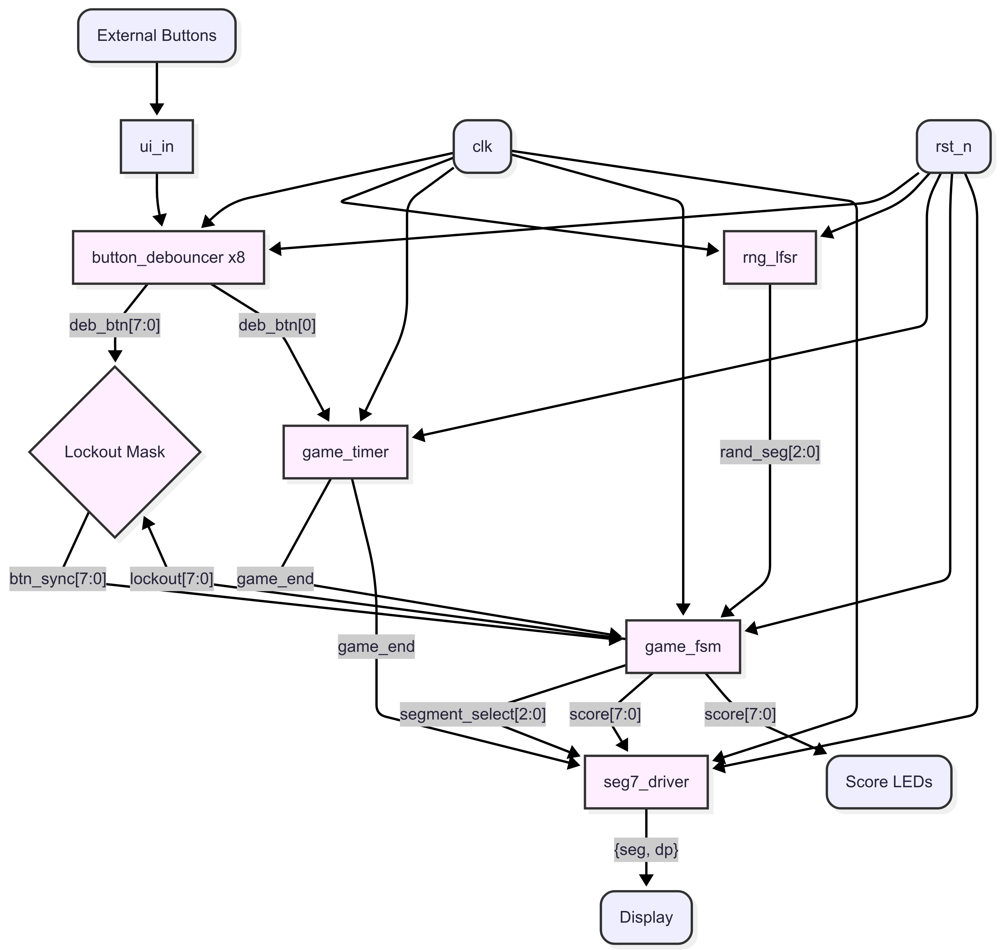

<!---

This file is used to generate your project datasheet. Please fill in the information below and delete any unused
sections.

You can also include images in this folder and reference them in the markdown. Each image must be less than
512 kb in size, and the combined size of all images must be less than 1 MB.
-->

## How it works

This tiny ASIC lights up random segments of a 7-segment display and challenges the player to hit the corresponding push-button as fast as possible. Each correct press turns that segment off and scores a point; each incorrect press “locks out” that button for the remainder of the round. A countdown timer limits the game duration, and the final score is shown on the display.


# 🎮 Game Flow – Whack-a-Mole FSM Sequence

<details>
<summary><strong>Click to expand full FSM sequence</strong></summary>

---

### 🔌 Upon Power-Up / Reset

- **Asynchronous Reset**
  - All registers are cleared:
    - `score_cnt`, `lockout`, `LFSR seed`, `timers`, `FSM state`
  - Initial values:
    ```verilog
    score_cnt ← 0
    lockout ← 0
    segment_select ← 0
    ```

- **Auto-Start**
  - On the **first rising edge of `clk`** after `rst_n` goes high:
    - FSM enters the `NEXT` state directly (no idle/manual start)
    - `game_timer` and `lock_timer` reset to 0

---

### ▶️ NEXT State

- **Mole Selection**
  - Sample lower 3 bits of 16→3 bit LFSR: `rand_seg`
  - If `rand_seg == 7`, wrap to 0 → only segments `0–6` used

- **Penalty Reset**
  ```verilog
  lockout ← 0
  lock_timer ← 0
  ```

- **Display**
  - `dp = 1` → game running
  - Illuminate one segment (`segment_select`) → active mole
  - Transition to `WAIT` state

---

### ⏳ WAIT State

- **Game Clock**
  - Increment `game_timer` each clock cycle
  - If `game_timer ≥ TARGET_COUNT`:
    - `game_end ← 1`

- **Hit Detection (Edge-Qualified)**
  - **Correct hit**:
    - Rising edge on `btn_sync[segment_select]`
    - `score_cnt++`
    - FSM → `NEXT`

  - **Wrong hit**:
    - Rising edge on other `btn_sync[i]`, and `lock_timer == 0`
    - Trigger penalty:
      ```verilog
      lockout[i] ← 1
      lock_timer ← LOCK_CYCLES  // (~1s in silicon, ~10 cycles in SIM)
      ```

- **Penalty Countdown**
  - If `lock_timer > 0`, decrement each cycle
  - When it hits 1:
    - Clear `lockout`

- **Game End Check**
  - If `game_end == 1`, transition to → `GAME_OVER`

---

### 🛑 GAME_OVER State

- **Disable Input**
  - `lockout ← 8'hFF` → all buttons locked

- **Display Final Score**
  - `dp = 0` → game over
  - 7-segment display **blinks** between tens and ones digits of `score_cnt` every ~0.5s

- **Wait for Restart**
  - Only a **debounced rising edge** on `btn_sync[0]` will:
    - Clear `score_cnt`, `lockout`, `lock_timer`, `game_timer`
    - FSM auto-restarts at `NEXT`

---
</details>

Image



**I/O Signal Assignment**

| Signal Name   | Direction | Width | Description                                    |
| ------------- | --------- | :---: | ---------------------------------------------- |
| clk         | input     |   1   | System clock                                   |
| rst_n       | input     |   1   | Active-low asynchronous reset                  |
| ena         | input     |   1   | Tiny Tapeout harness enable                    |
| seg7_a…g    | output    |   7   | 7-segment segments (maps to uo_out[6:0])     |
| seg7_dp     | output    |   1   | Decimal point (maps to uo_out[7])            |
| btn[7:0]    | input     |   8   | Push-button inputs (maps to ui_in[7:0])      |
| score[7:0]  | output    |   8   | Binary score output (maps to uio_out[7:0])   |
| uio_oe[7:0] | output    |   8   | Output enables for uio (permanently enabled) |

**Internal Signals**
| Name                  | Width | From → To                          | Description                                          |
| --------------------- | :---: | ---------------------------------- | ---------------------------------------------------- |
| `ui_del[7:0]`         |   8   | Pad → double-invert chain          | First inversion of raw inputs                        |
| `ui_buf[7:0]`         |   8   | `ui_del` → double-invert chain     | Second inversion (restores original bits)            |
| `ui_buf2[7:0]`        |   8   | `ui_buf` → double-invert chain     | Third inversion                                      |
| `ui_buf3[7:0]`        |   8   | `ui_buf2` → synchronizer           | Fourth inversion, final delayed bus                  |
| `ui_sync[7:0]`        |   8   | `ui_buf3` → debouncer              | Synchronized & delayed button inputs                 |
| `deb_btn[7:0]`        |   8   | debouncer → FSM                    | Debounced button signals                             |
| `start_btn`           |   1   | `deb_btn[0]` → timer & FSM         | “Start” push-button after debounce                   |
| `rand_seg[2:0]`       |   3   | RNG → FSM                          | Next segment index from LFSR                         |
| `btn_sync[7:0]`       |   8   | `deb_btn & ~lockout` → FSM         | Masked & debounced inputs into the FSM               |
| `segment_select[2:0]` |   3   | FSM → seg7\_driver                 | Which segment (0–6) is currently active              |
| `lockout[7:0]`        |   8   | FSM → mask logic                   | One-cycle penalty mask for wrong presses             |
| `score[7:0]`          |   8   | FSM → seg7\_driver & score reg     | Current hit count                                    |
| `seg[6:0]`            |   7   | seg7\_driver → `uo_out`            | 7-segment cathode/anode pattern                      |
| `dp`                  |   1   | seg7\_driver → `uo_out`            | Decimal-point control (1 during play, 0 at game-end) |
| `uio_out_reg[7:0]`    |   8   | score → negedge pipeline reg       | Registered on negedge for `uio_out`                  |
| `uo_out_reg[7:0]`     |   8   | `{dp, seg}` → negedge pipeline reg | Registered on negedge for `uo_out`                   |


## How to test
Verification is performed through a combination of simulation and on-hardware validation.
1. RTL Simulation with cocotb
A Python-based cocotb testbench is used to perform automated unit tests on the Verilog modules.
2. Post-Layout Simulation
The same cocotb testbench is run on the gate-level netlist generated by OpenLane to ensure the design still functions correctly with physical timing delays included.
3. On-Hardware Validation
Once fabricated, the ASIC can be placed on the Tiny Tapeout test board and connected to the required external hardware to verify real-world functionality.


## Verification Strategy
The primary goal is to verify the functional and timing correctness of the Whack-a-Mole ASIC design. Our strategy relies on a comprehensive, Python-based cocotb testbench to simulate the design's behavior in response to various stimuli. Verification will be performed at two stages: pre-layout (RTL) and post-layout (gate-level). The target is 100% functional coverage of all specified features and 100% code coverage of the Verilog source.
### Test Environment
Simulator: Icarus Verilog (iverilog) for RTL simulation.
Testbench Framework: cocotb.
HDL: Verilog (IEEE 1364-2005).
Physical Design Flow: OpenLane.
Waveform Viewer: GTKWave.
---

## 🧾 Test Cases

---

### 🔄 Reset Behavior

| Test Case ID     | Description                                                              | Testbench Function             |
|------------------|--------------------------------------------------------------------------|--------------------------------|
| `TC-RESET-01`    | Game auto-starts with one active mole upon `rst_n` de-assertion.         | `test_auto_start_on_reset`     |

<details>
<summary>Waveform</summary>

</details>

---

### 🎮 Gameplay Logic

| Test Case ID        | Description                                                                 | Testbench Function(s)                        |
|---------------------|-----------------------------------------------------------------------------|----------------------------------------------|
| `TC-GAMEPLAY-01`    | Correct button press increments score.                                     | `test_score_increment`                       |
| `TC-GAMEPLAY-02`    | Incorrect button press does **not** increment score.                        | `test_no_increment_on_wrong`                |
| `TC-GAMEPLAY-03`    | Restart button (`pb[0]`) mid-game has no effect.                            | `test_no_midgame_restart`                   |

<details><summary>Waveforms</summary>

- **TC-GAMEPLAY-01**  
  

- **TC-GAMEPLAY-02**  
  

- **TC-GAMEPLAY-03**  
  

</details>

---

### 🛡️ Debounce Filtering

| Test Case ID        | Description                                                                 | Testbench Function(s)                        |
|---------------------|-----------------------------------------------------------------------------|----------------------------------------------|
| `TC-DEBOUNCE-01`    | Glitches < 4 cycles are ignored.                                             | `test_button_debounce_filter`                |
| `TC-DEBOUNCE-02`    | Presses ≥ 4 cycles are registered.                                           | `test_button_debounce_stable`                |

<details><summary>Waveforms</summary>

- **TC-DEBOUNCE-01**  
  

- **TC-DEBOUNCE-02**  
  

</details>

---

### 🔒 Lockout Mechanism

| Test Case ID        | Description                                                                 | Testbench Function(s)                        |
|---------------------|-----------------------------------------------------------------------------|----------------------------------------------|
| `TC-LOCKOUT-01`     | Wrong press initiates a 1-second lockout.                                   | `test_one_second_lockout`                    |
| `TC-LOCKOUT-02`     | Lockout clears automatically after timeout.                                 | `test_one_second_lockout`                    |
| `TC-LOCKOUT-03`     | Independent wrong buttons can lock out separately.                          | `test_lockout_independent_buttons`           |

<details>
<summary>Waveform</summary>

</details>

---

### ⏱️ Timer & DP LED Behavior

| Test Case ID        | Description                                                                 | Testbench Function(s)                        |
|---------------------|-----------------------------------------------------------------------------|----------------------------------------------|
| `TC-TIMER-01`       | Game ends and `dp` LED turns off on timer expiration.                       | `test_dp_behavior`                           |

<details>
<summary>Waveform</summary>

</details>

---

### 🔁 Game Restart

| Test Case ID        | Description                                                                 | Testbench Function                           |
|---------------------|-----------------------------------------------------------------------------|----------------------------------------------|
| `TC-RESTART-01`     | `pb[0]` restart after game-over (debounced).                                | `test_restart_debounce`                      |

<details>
<summary>Waveform</summary>

</details>

---

### 📺 Display Tests

| Test Case ID        | Description                                                                 | Testbench Function(s)                        |
|---------------------|-----------------------------------------------------------------------------|----------------------------------------------|
| `TC-DISPLAY-01`     | Active mole segment shown correctly during play.                            | `test_game_end_display`                      |
| `TC-DISPLAY-02`     | Final score shown on time (after 1500+ cycles).                             | `test_game_timer`                            |
| `TC-DISPLAY-03`     | Score blinks alternating digits after game ends.                            | `test_score_rollover_display`                |

<details><summary>Waveforms</summary>

- **TC-DISPLAY-01**  
  

- **TC-DISPLAY-02**  
  

- **TC-DISPLAY-03**  
  

</details>

---

### 🎲 Random Segment Generation

| Test Case ID        | Description                                                                 | Testbench Function                           |
|---------------------|-----------------------------------------------------------------------------|----------------------------------------------|
| `TC-RNG-01`         | Random segment selector never outputs index `7`.                            | `test_segment_never_seven`                   |

---

# ⏱️ Static Timing Analysis (STA) – Final Post-Layout Results

This section documents the final post-layout STA for the **Whack-a-Mole ASIC**. Timing analysis was conducted using **OpenSTA** at the **`tt`** corner. All **setup**, **hold**, **removal**, and **recovery** paths passed timing checks.

---

## ✅ Summary Table

| Path Type | Startpoint         | Endpoint          | Check Type     | Slack       | Status  |
|-----------|--------------------|-------------------|----------------|-------------|---------|
| Removal   | `rst_n`            | `_0984_`          | Removal        | +0.31 ns    | ✅ MET  |
| Hold      | `ui_in[3]`         | `_0963_`          | Hold           | +0.09 ns    | ✅ MET  |
| Recovery  | `rst_n`            | `_0957_`          | Recovery       | +48.78 ns   | ✅ MET  |
| Setup     | `_1018_`           | `_0947_`          | Setup          | +45.95 ns   | ✅ MET  |

---

## 🧠 Context & Justification

- All asynchronous reset paths using `rst_n` **passed removal and recovery checks**, indicating safe release timing.

- Long setup paths (clk → clk') in the datapath still maintain **>45 ns slack**, confirming **ample timing margin** post-routing.

---

# Contributions
---
Armaan Ghosh 
- Module Compilation, Test Generation, Documentation

Erkam Boyacioglu
- Module Compilation, Module Testing, Waveform and STA analyis

Special thanks to:
Professors: John Long and Vincent Gaudet
TA: Refik Yalcin
